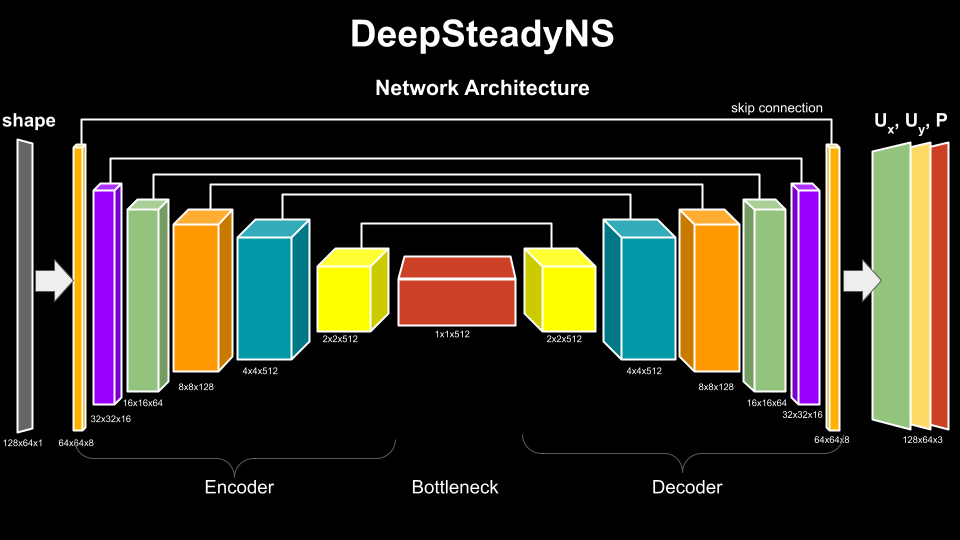
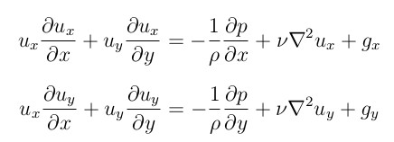
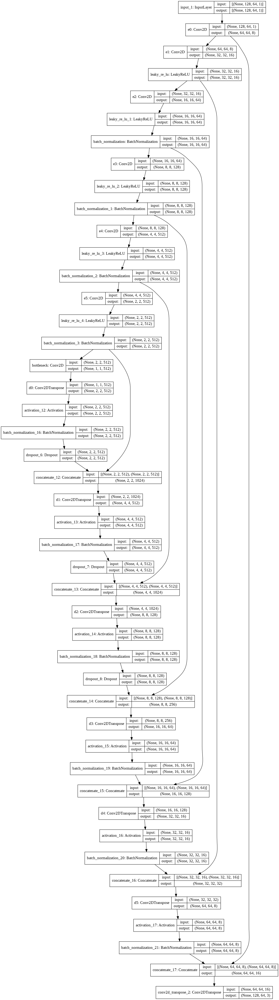
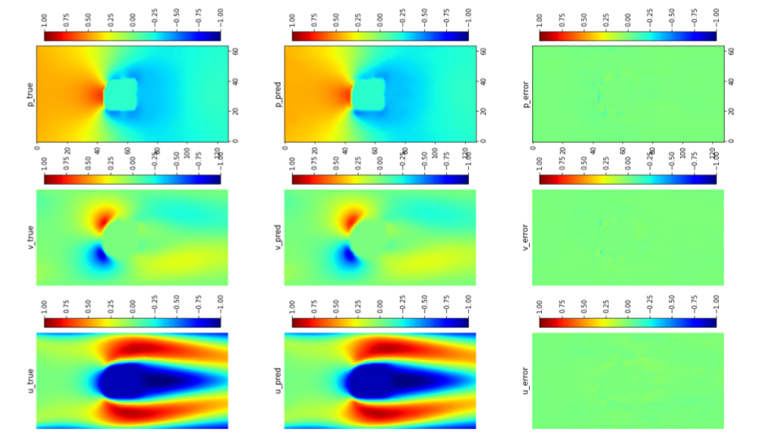
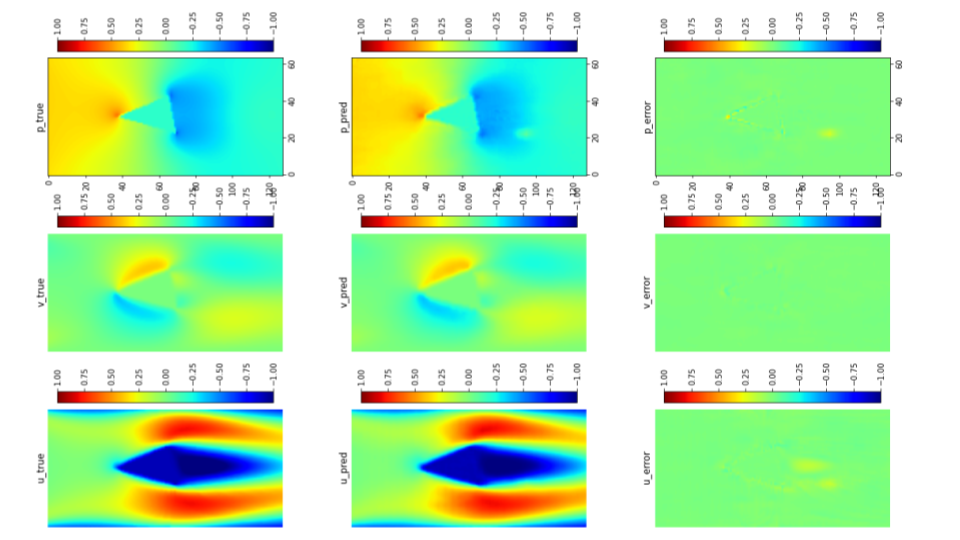
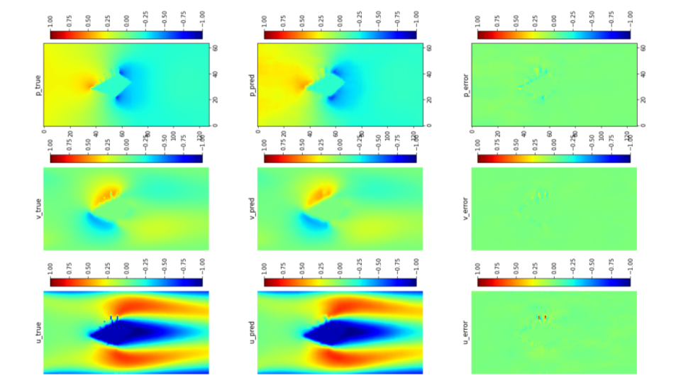
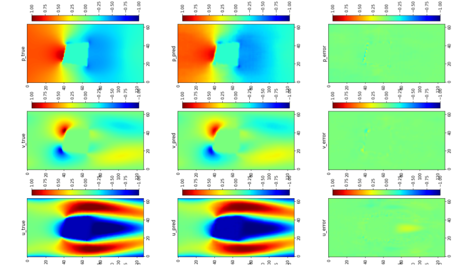

# DeepSteadyNS
Computational Fluid Dynamics (CFD) simulation by the numerical solution of the Navier-Stokes equations is an essential tool in a wide range of applications from engineering design to climate modeling. However, the computational cost and memory demand required by CFD codes may become very high for flows of practical interest, such as in aerodynamic shape optimization. This expense is associated with the complexity of the fluid flow governing equations, which include non-linear partial derivative terms that are of difficult solution, leading to long computational times and limiting the number of hypotheses that can be tested during the process of iterative design. Therefore, I propose DeepSteadyNS: a convolutional neural network (CNN) based model that efficiently approximates solutions for the problem of non-uniform steady laminar flows. The proposed model is able to learn complete solutions of the Navier-Stokes equations, for both velocity and pressure fields, directly from ground-truth data generated using a state-of-the-art CFD. It leverages the techniques of machine learning along with Navier-Strokes based loss function for steady state for faster convergence. Using DeepSteadyNS, we found a speedup of up to 3 orders of magnitude compared to the standard CFD approach at a cost of low error rates.

## Architecture

- The architecture is a UNet based architecture with single channel (128x64x1) input scaled between 0 (object) to 1 (empty space).

- This is first scaled to (64x64x8) by passing through 8 convolutional filters with strides (2,1) followed by various encoding layers . Activation function used is Leaky_ReLU (0.2)

- This feature vector then passes through various other encoding layers with stride of (2,2) till the final bottleneck of shape (1x1x512)

- Decoding layer sequence is just opposite of that of encoding layers which upscale the feature vector using Conv2DTranspose with stride (2,2) back to shape of 64x64x8. Activation function used is ReLU

- This decoded feature vector is then passed through final 3 Conv2DTranspose filters to give steady state u, v, p fields

- Each decoding layer has a concatenation operation by corresponding encoding layer using skip connection. This helps in sharing featurewise information between input and output thereby preserving geometrical features and appropriately transforming according to them. Skip connections also help in tackling the problem of vanishing gradients in deeper networks

## Loss function

Loss function is a combination of mean absolute error (MAE) and the steady-state navier-strokes loss function based on the equation mentioned below

Partial Differential terms and laplacian transform are computed using tensor gradient formulation from tensorflow library

**MAE** : mean of all absolute errors in prediction of pixel values 

**Steady-state-Navier-loss** : ex2 + ey2

ex : Error in steady state navier-stokes equation in X-direction

ey : Error in steady state navier-stokes equation in Y-direction

### Final loss function :
Loss = MAE +  λ * steady_state_navier_loss 

For a simpler formulation, I have kept the body force fields to 0 and lamda is set to 1

**[Note]:** More tinkering with network architecture and loss hyperparameters required. Also, generalize this to 3D

[Link to trained model](https://drive.google.com/drive/folders/1T_Yk7x_s5eFpHl51o7Ld1oPHgth4W8gV?usp=sharing)

## Training
- **Filter count:** (8, 16, 64, 128, 512, 512) (512) (512,512, 128, 64, 16, 8) (3)
- **Optimizer:** Adam (LR = 0.01)
- **Dropout:** 0.2
- **Validation split:** 0.2
- **Metrics of evaluation:** MAE, MAPE, Cosine_proximity

## Results
Following are few of the cherry-picked results obtained

## Credits
This work is based on an earlier of [DeepCFD](https://arxiv.org/abs/2004.08826). Few of the unused code and insipiration is from the [github repository](https://github.com/mdribeiro/DeepCFD) of the same paper although the architecture and loss functions are completely changed for better convergence. The data used to train the model is also provided in the repository. [Link to data here](https://zenodo.org/record/3666056/files/DeepCFD.zip?download=1) 

## About me
This repository is made by Ritvik Pandey for the academic use as Maters Thesis Project (MTP) for Department of Mechanical Engineering, Indian Institute of Technology Kharagpur (IIT-KGP) under the guidance of Professor Rajaram Lakkaraju

Contact: ritvik.pandey03@gmail.com
